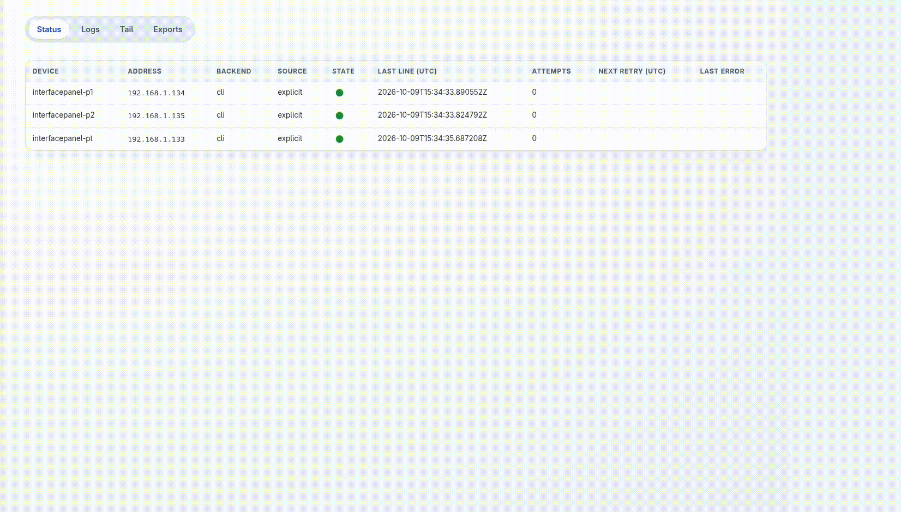

# esphome-log-collector

[](https://github.com/f18m/esphome-log-collector/releases)
[](https://pypi.org/project/esphome-log-collector/)
[](https://github.com/f18m/esphome-log-collector/actions/workflows/docker-publish.yml)
[](https://github.com/f18m/esphome-log-collector/pkgs/container/esphome-log-collector)

A Docker-friendly service that continuously collects and retains **ESPHome firmware logs** from many
devices. It reconnects after device/network outages, keeps logs across container restarts and lets you
investigate intermittent crashes and reboots after the fact.

It features an SQLite storage, configurable retention, possibility to export tarballs
with sanitized configuration snapshots and an optional web UI to browse the logs.

* Pinned ESPHome version: **2026.9.1** (`requirements.txt`).
* No Home Assistant, Docker socket or systemd required. Explicit IP targets work without mDNS.
* Integrates with [ESPHome](https://esphome.io/) and its native API library
  [aioesphomeapi](https://github.com/esphome/aioesphomeapi); optional mDNS discovery uses
  [python-zeroconf](https://github.com/python-zeroconf/python-zeroconf).



## Quick start

```bash
cp examples/config.example.yaml config.yaml          # edit: devices, secrets, retention
cp docker-compose.example.yml docker-compose.yml     # edit the mounts
docker compose build
docker compose run --rm esphome-log-collector check-config   # validate the YAML, then
docker compose up -d
docker compose logs -f                                # the collector's own operational log
```

Commands (`esphome-log-collector <command>`; the image entrypoint is this program):

| Command | Purpose |
|---|---|
| `run` | Collect until SIGTERM/SIGINT (default container command). |
| `check-config` | Validate the YAML and exit (exit code 2 + all errors listed on failure). |
| `export` | Create an export tarball (see [Export](#export-tarball)). |
| `healthcheck` | Exit 0 when the collector process is healthy (used by the Docker `HEALTHCHECK`). |

The collector's own config path is `-c/--config`, default `$ESPHOME_LOG_COLLECTOR_CONFIG`
(`/config/config.yaml`). In Docker, reserve `/config` for that file and mount ESPHome device YAMLs
and their adjacent `secrets.yaml` separately at `/esphome`; use `/esphome/...` for `config_file`,
`capture.watch_files`, and `discovery.config_dir`.

## Configuration

One YAML file, mounted read-only. [`examples/config.example.yaml`](examples/config.example.yaml) is a
complete, documented example and is validated by the test suite. Unknown keys, bad values, missing
files and unset secrets are **errors** reported together at startup; nothing is silently skipped or
defaulted. Changes require a restart.

Sections: `collector`, `storage`, `defaults`, `devices`, `discovery`, `retention`, `capture`, `web`.
`defaults` (`backend`, `retry`, `idle_timeout`, `logs`, `api`, `substitutions`, `capture`) are merged
into every device; each device can override any of them. Devices need a stable `name`
(`[A-Za-z0-9._-]`, max 64) and `address` and/or `esphome_name`.

### Credentials

Credential fields accept `{env: NAME}` (environment variable), `{file: /run/secrets/x}` (Docker
secret; trailing newline stripped) or a plain string (works, but logs a warning). A missing variable or
unreadable file is a startup error. Resolved secrets are masked in the collector's own log output.
Note that the `esphome logs` CLI only accepts MQTT credentials as command-line arguments, so
`logs.mqtt_password` is visible in the container's process list while a CLI session runs.

### Backends

* `cli` – supervised `esphome logs` subprocess per device (argument array, no shell). Needs the
  device's ESPHome YAML (`config_file`) because the CLI requires it to resolve substitutions, API
  encryption keys, OTA names or MQTT settings. ESPHome's own data directory is redirected to
  `<storage.path>/esphome-data/<device>` (`ESPHOME_DATA_DIR`), so the config mount can be read-only.
* `api` – the native ESPHome API through `aioesphomeapi` (the library behind `esphome logs`), for
  devices without a YAML file. Uses `api.port`, `api.noise_psk` (encryption key) and `api.password`.
  Differences: lines are prefixed with the collector's UTC `[HH:MM:SS]` (so `device_time` holds that collector time for API lines, not the device clock); MQTT/serial are not available.
* `auto` (default) – `cli` when `config_file` is set, otherwise `api`.

### `esphome logs` options (backend `cli`)

`esphome logs --help` in ESPHome 2026.9.1 offers exactly these options; all are configurable under
`logs:` (per device or in `defaults`, except `device` and `reset`, which are per device only):

| YAML (`logs.`) | CLI argument | Notes |
|---|---|---|
| `device` | `--device` | Serial port, address, `MQTT`… Defaults to the device `address` when set. |
| `mqtt_topic` | `--topic` | |
| `mqtt_username` | `--username` | |
| `mqtt_password` | `--password` | secret reference |
| `client_id` | `--client-id` | |
| `reset` | `--reset` | **Disruptive** (resets the device before serial logging). Per-device opt-in only, never default, rejected in `defaults`. |
| `states` | `--states/--no-states` | |
| `extra_args` | verbatim | Pass-through for future/rare flags; only `--flag` / `--flag=value` forms. Managed flags (the ones above, `--help`, config/output/log-file/substitution/verbosity options, and any unambiguous abbreviation of them) and positional values are rejected. |

Also `substitutions: {k: v}` (→ `esphome -s k v`). The command is always
`esphome [-s k v …] logs [options] -- <config_file>`.

### Supervision, reconnects, sessions

Each device runs in its own asyncio task and subprocess; one failing device (crash, bad output, missing
binary, exit code ≠ 0) never affects others. After a session ends the collector waits
`min(max_delay, initial_delay × multiplier^attempt)` ± `jitter`, and the backoff resets after a
session of `reset_after` seconds. `idle_timeout` (default off) restarts connections that go silent.

Every session gets a UUID. Collector-generated events are stored alongside firmware lines
(`event_type`): `session_start`, `connected`, `disconnected`, `retry_scheduled`, `gap` (time since the
previous stored event, so outages and restarts are visible), `collector_error`, `session_end`. A
session left open by a crash/kill is closed with reason `collector_crashed_or_killed` on next start.
When `esphome logs` exits with an error, the collector error includes a bounded, redacted excerpt
from the beginning and end of its output plus lines that look diagnostic, so config dumps do not
hide the original failure reason.
`connected` is recorded when the first firmware log line (or "Successfully connected") appears.

### Discovery (optional)

`discovery.enabled: true` browses mDNS (`_esphomelib._tcp.local.`) with zeroconf. (ESPHome 2026.9.1's
`esphome discover` is not a reliable discovery mechanism, hence zeroconf directly.) Discovery must be
restricted: `names`, `name_prefixes` and/or `exclude_names`, or an explicit `allow_all: true`.
Discovered devices that match an explicit target by name, `esphome_name` or address are dropped
(explicit configuration wins). A discovered device uses the `cli` backend if
`<discovery.config_dir>/<name>.yaml` exists, otherwise `api` with the `defaults`. mDNS multicast does not
cross Docker's default bridge: use `network_mode: host` (or a macvlan/mDNS reflector) for discovery
or for `<name>.local` resolution. Explicit IP targets need none of this.

## Storage

SQLite (`<storage.path>/collector.sqlite3`; WAL journal, `synchronous=NORMAL`, foreign keys,
`auto_vacuum=INCREMENTAL`) is the source of truth. Each line is committed in its own transaction.

`events`: `id`, `ts`, `device`, `address`, `session_id`, `event_type`, `level`, `component`,
`device_time`, `message`, `raw`; indexes on `(device, ts)`, `ts`, `session_id`. Also `sessions`,
`device_status`, `config_snapshots`, `meta`.

* **Timestamps** are UTC, ISO-8601 with microseconds (`2025-01-31T12:00:00.123456Z`), assigned by the
  collector **when the line is received** (ESPHome's wall-clock text, when present, is in `raw` and
  parsed into `device_time`; device clocks are not trusted).
* **Raw lines** are stored after credential redaction (ANSI sequences included, invalid UTF-8
  replaced). `level`/`component`/`message` are best-effort parses of ESPHome's
  `[HH:MM:SS][I][comp:line]: text` format and `INFO text` CLI lines; unparsed lines keep
  `level`/`component` NULL. ANSI-stripped text is available in exports (`clean`) and in the web UI.
* `storage.raw_files.enabled: true` also appends `<ts> <raw line>` to `<path>/raw/<device>.log`
  (rotated once to `.log.1` at `max_file_mb`). This is a convenience copy; SQLite stays authoritative.

## Retention

Runs every `cleanup_interval_seconds` in committed batches (`batch_size`, at most `max_batches_per_run`
batches per run – leftovers are deferred to the next run and logged), so collection continues during
cleanup. Everything deleted is counted in the log; nothing outside these policies is removed.

* `max_age_days` – delete events older than this. `per_device.<name>.max_age_days` / `max_events`.
* `max_total_size_mb` – measured as **live database pages** (`(page_count − freelist_count) ×
  page_size`) of `collector.sqlite3`. WAL (bounded by `journal_size_limit` and checkpoints), exports,
  raw files and ESPHome data are not counted. When exceeded, the oldest events (all devices, by id) are
  deleted until under the limit and freed pages are returned to the filesystem
  (`incremental_vacuum`). If no events remain but the limit is still exceeded (snapshots/metadata), a
  warning is logged.
* `config_snapshots.max_age_days` / `keep_last` (default 20 per device).
* `exports.max_age_days` (default 14) / `max_total_size_mb` – only files created by the exporter
  (`esphome-log-export-*.tar.gz`, stale `.export-tmp-*`) are ever deleted.
* Sessions without remaining events are pruned. Raw files follow `raw_files.max_file_mb`.

## Device configuration capture

With `capture.enabled`, `esphome config -- <config_file>` is run per device with a `config_file`
(on startup, every `interval_seconds`, and/or when the YAML or `capture.watch_files` change – polled
every 30 s). The output is **redacted before it is stored** (`config_snapshots`) and again on export;
identical results are not stored twice. Failures are logged and recorded as `collector_error` events.

Redacted: values (including nested mappings/lists and block scalars) under any key containing
`password/passwd/passphrase/psk/secret/token/key/credential/auth/bearer/private/cert/signature/pairing`
(API encryption keys, Wi-Fi/OTA/MQTT passwords, tokens…), PEM key/certificate blocks, credentials in
URLs, and the exact values of all credentials resolved from the collector config. Add your own with
`capture.extra_key_patterns` (regexes on YAML keys) and `capture.extra_value_patterns` (regexes replaced
anywhere). SSIDs and other non-credential values are kept. Source secret files are never read, stored
or exported (only hashed for change detection). Review a snapshot for your own setup before sharing.

## Export tarball

```bash
docker compose exec esphome-log-collector esphome-log-collector export \
    --device living-room --start 2025-01-30T00:00:00Z --end 2025-01-31T00:00:00Z
```

`--device` (repeatable; default all), `--start` (inclusive) / `--end` (exclusive) as UTC ISO-8601,
`--no-configs`, `--output-dir`. Written atomically to `storage.export_dir` as
`esphome-log-export-<UTC>-<random>.tar.gz` (also available from the web UI). Contents:

```
manifest.json                 format version, filters, per-file size + sha256, record counts
logs/<device>.jsonl           one JSON event per line: id, timestamp, device, address, session_id,
                              event_type, level, component, device_time, message, raw, clean
metadata/sessions.jsonl       sessions overlapping the window
metadata/device_status.json   last known status per device
configs/<device>/*.yaml       sanitized snapshots (window + the one in effect), unless --no-configs
```

All data is read inside one SQLite read transaction (a consistent snapshot while collection runs). Archive
member names are generated by the exporter from validated device names; SQLite/WAL files, source secret
files, unredacted configuration and temp files are never included.

## Web UI (optional, read-only)

Disabled by default. `web.enabled: true`, `bind` (default **127.0.0.1**), `port`, `page_size`,
`allowed_hosts`. Pages: status (`/`), terminal-style search (`/logs`: device, time range, minimum log
level, event type, text; paginated), live log tail (`/tail`: device, minimum log level, event type and
text filters), exports (`/exports`: create + download). The tail streams newly stored events to the
browser and reconnects automatically.
JSON: `/api/status`, `/api/logs`; Server-Sent Events: `/api/tail` (used by `/tail`). Standard library
only; no device-control operations; the only write is "create export" (CSRF-protected POST).

**There is no authentication.** Keep the default localhost binding, or bind `0.0.0.0` only inside the
container, publish the port on `127.0.0.1` / a private network, and put an authenticated reverse proxy
(basic auth, OIDC, VPN) in front. Set `allowed_hosts` to the proxy's host name to block DNS rebinding.

## Docker

Images are published to [GitHub Container Registry](https://github.com/f18m/esphome-log-collector/pkgs/container/esphome-log-collector).
The `latest` tag tracks `main` and tagged releases; version-specific tags are also published.

* `Dockerfile`: `python:3.12-slim-bookworm` pinned by digest, pinned dependencies, multi-stage,
  includes `git` and CA certificates for ESPHome remote packages, non-root user `collector` (uid
  10001), `HEALTHCHECK`, `SIGTERM` for graceful shutdown. Non-Docker installations using ESPHome
  configurations with remote packages also need the `git` executable installed.
* Mount the collector YAML at `/config/config.yaml` and ESPHome device YAMLs plus their adjacent
  `secrets.yaml` at `/esphome`, all read-only (`:ro`). Keep `/data` writable (a named volume, or a
  bind mount owned by uid 10001). Logs of the collector go to stderr; firmware logs go to `/data`.
* **Health**: the process writes a heartbeat file every 10 s; `healthcheck` fails only if the collector
  is gone or its event loop stalled (> 60 s). Offline ESPHome devices never fail it; see per-device state
  in `/api/status` or the `device_status` table.
* **Shutdown**: SIGTERM stops each `esphome` child (SIGTERM, then SIGKILL after `stop_grace_seconds`),
  closes sessions, checkpoints the WAL and closes SQLite. Use `init: true` / `docker run --init`.
* Serial devices: pass `devices:` through and use `logs.device: /dev/ttyUSB0`.

## Development and tests

Package builds get their version from Git tags (use `vX.Y.Z` for releases); commits after
a tag get a PEP 440 development version. `0.1.0` is the fallback when SCM metadata is unavailable.
The web UI templates and static assets live in
[`src/esphome_log_collector/web_assets/`](src/esphome_log_collector/web_assets/) and are included in
Python package builds.

```bash
python -m venv .venv && . .venv/bin/activate
pip install -r requirements-dev.txt && pip install --no-deps -e .
python -m pytest            # full suite (uses a fake esphome CLI + a real ESPHome for the option check)
docker build -t esphome-log-collector .
```

## Security notes

Credentials come from env/files, never from source or the example; they are masked in collector logs
and exports. CLI output is scrubbed for credential-like YAML keys, exact values from the adjacent
ESPHome `secrets.yaml`, and configured redaction patterns before it is stored. Commands use argument
arrays (no shell), `extra_args` cannot override managed options, the web UI and exports only serve
generated names under the export directory, and the subprocess receives a minimal environment.
Custom firmware messages containing values not covered by the redaction rules may still be retained;
do not log credentials from firmware.
